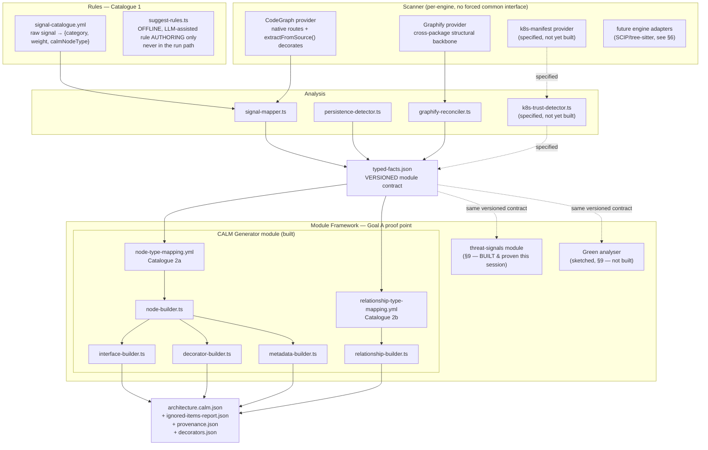

# Architecture-as-Code Solution Design v2

**Status: LOCKED — construction architecture and phased-build discipline.** The core pattern this document specifies (three-plus construct-mapping catalogues, catalogue-driven builders, the deterministic-core/override-escape-hatch split, phased engine adoption) has been built and verified against real, varied conditions — not just designed — and further building should extend it with catalogue rows and new builders, not revisit its structure, unless a future finding proves a genuine mismatch (none has, so far; every gap found has been a narrow, fixable bug or a real-but-bounded architectural correction, see the two entries below).

**Living status matrix:** `docs/solution/Capabilities.md` (Platform + Extraction sections) is the short inventory of built / partial / backlog — prefer it over any stale sentence in this banner when they disagree.

**What locking does *not* cover** — still open or only partial (do **not** re-read this as “Goal A never shipped”):

| Area | Current truth (see also `Capabilities.md`) |
|---|---|
| **Goal A — modular platform** | **Partially delivered:** `contractVersion`, `modules/registry.ts`, `available-modules.ts` + `--modules`, second module `threat-signals`, namespaced module outputs. **Still open:** seamless third-party plugin discovery, library embed API (Wave G), full analysis-pass/engine routing maturity. |
| **Persistence genericity** | Bare `@Entity` + **driver-import** strategy catalogue **dispatched**; Spring Data / jOOQ / multi-shape strategies **designed, not fully dispatched**. |
| **Platform IR (§13) / LLM advisory (§7.1)** | Optional UX; override mechanism works without them. IR may be in progress under extraction MVP — track in `Capabilities.md` Extraction section, not assumed zero forever. |
| **k8s trust, OpenAPI (if not yet in STATUS)** | Backlog or in-progress per `Capabilities.md` — not part of the locked construction *pattern*. |
| **Full-scale (7,000+ file) E2E** | Graphify-scale timing evidence exists; full pipeline construction at that scale not the lock criterion. |

**Two real, load-bearing corrections made after this document was first written, both closed, both worth knowing before treating anything here as untested prose:**
1. **Cross-package relationship detection — claimed since `v0.6 §4`, never once verified, root cause was structural** (Graphify was invoked once per root, which cannot produce a cross-root edge by construction — not a bug in the reconciler, a bug in how it was fed). Fixed: one combined Graphify pass per run, covering the common ancestor of all given roots. Verified with 265 real cross-module edges in real the reference Java/JAX-RS banking platform source, including the exact evidenced case. Full detail in `CLAUDE.md`'s pipeline-architecture section — including a real, disclosed trade-off (Graphify itself occasionally under-resolves a same-package edge at wider scan scope) that was not papered over.
2. **A design-doc assumption about control `requirement-url`s ("still schema-valid CALM, the field just needs to be a string," `v0.10 §0`) was falsified by actually running `calm validate`** — it does a live remote-host-allowlist check. Fixed using `calm-cli`'s own `-u/--url-to-local-file-mapping` mechanism; see §5.5's inline correction.

**First persistent solution-design document in this repo** (`docs/solution/` created this round). Supersedes no prior file — the only earlier solution-design material is the external `Architecture_as_Code_Solution_Design_v1.docx`/`Architecture_as_Code_V1_Playbook.md` (not in this repo; known only via `docs/spikes/AaC_Solution_Design_Critical_Review.md`) and the paused, narrower `scalable-dreaming-hearth` plan (CALM-construction two-catalogue design only — folded into §5 here, not superseded, since its content is still correct, just incomplete relative to the dual-goal scope below).

**Produced against:** `docs/requirements/CALM_Generator_Requirements_v0_14.md` (current), the full v0.1–v0.14 requirements chain, `docs/spikes/*`, and the real `pipeline/src/` codebase — read directly this session, not recalled.

---

## 0. Document structure & authority

**Structural decision** (`docs/solution/AGENT TASKS Solution Cleanup and Prioritized Actions` T-A0, confirmed rather than left implicit): this repository keeps **one platform root + language annexes**, not one monolithic solution document. A full merge would recreate the exact failure mode `docs/spikes/Solution_Design_v2_Critical_Review.md` §3 found between this document and the Java companion — contradictory "locked" claims sitting in one file — and would make every Java/Node/Python-specific churn rewrite the platform story unnecessarily.

```
docs/solution/
  Architecture_as_Code_Solution_Design_v2.md   # platform + CALM construction (this file, root)
  language/
    java.md                                    # Slice 2 Java — moved from Architecture as Code Java Solution Design
  Capabilities.md                                    # living built/partial/backlog (Platform + Extraction)
  Platform_Architecture_Analysis.md            # this system as software (style, runtime, deployment, quality attributes)
  Modularity and Integration Assessment     # modularity grade + P0-P2 recommendations (implemented as Wave M)
  AGENT TASKS Solution Cleanup and Prioritized Actions
  AGENT TASKS Extraction Enrichment         # extraction MVP + integrity (Wave XI / X0–X10)
```

**Conflict rule** (authoritative — both this document and the language annexes must agree with it, and where they don't, this rule decides, not intuition): *Platform contracts and the CALM construction pattern → this root is authoritative. Slice 2 Java sequencing and Phase 1/2 engine choice → `language/java.md` is authoritative. `engine-capability-matrix.yml` (§6.1, once coded in `pipeline/src/scanner/`) is the runtime source of truth for engine routing — both docs' prose follows the matrix, not the reverse. Where prose conflicts, the more recent verified pipeline evidence wins, and the losing section gets corrected in the same edit, not left to drift.*

**Goal A status, stated precisely rather than left to a reader's inference** (`docs/spikes/Solution_Design_v2_Critical_Review.md` §2.3 High finding): Goal A (modular platform) is **partially delivered, not fully proven**. What's real: `contractVersion`, a working module registry (`modules/registry.ts`), and a genuine second module (`threat-signals`) consuming only `TypedFacts` — verified this session, not aspirational (§9, §Wave-C-verification below). What's still target architecture, not delivered foundation: module registration is a code edit, not config (Wave M T-M1 closes this); Scanner/orchestration remain a closed recipe, not a plugin bus (Wave M T-M7); no library/API embed surface exists (Wave G, explicitly deferred). Read Goal A as "real boundary, not yet a seamless platform" — both halves of that sentence matter.

## Part A — Readiness Assessment

**Verdict: READY WITH CONDITIONS.**

### Why not a blocking NOT READY

Every prior "not ready" finding in this project's own history had a concrete resolution path that has since been taken:

- Repo topology, mapping-config structure, Decision Record/Override schema, confidence-scoring weights, Ignored Items taxonomy — all drafted with real shapes in `Gap_Closure_Build_Ready_Specs_v0.1.md` §4–§7.
- The four items the enterprise-readiness review found silently dropped (numeric success metric, data-classification default, companion-interface auth status, Decision Record/Override build path) all got real, non-silent answers in `CALM_Generator_Requirements_v0_10.md` §1 — not "resolved" in the sense of being built, but resolved in the sense that no reviewer reading v0.10 forward is misled about their status.
- The extraction/construction engine is not paper design — it is real, running TypeScript (`pipeline/src/`), verified against real the reference Python microservices banking app services: 4/4 grep-verified routes, 6 real relationships recovered after the accuracy audit, `calm validate` passing with 0 errors/0 warnings.
- The requirements-collection methodology itself was self-corrected (`Evidence_Sampling_Methodology_Spike.md`) — a coverage matrix with cited/❌ cells, not convenience sampling, now grounds v0.13/v0.14.

### Conditions this design must satisfy (not blockers to starting — inputs to what "done" means)

1. **Fix `interacts`/`connects` by construction, not by patching the one branch that's currently wrong.** `build-calm.ts:67-69` (read directly this session) still emits `interacts: {source, destination}` — confirmed live, not stale. Requirements v0.9 §1 diagnosed this correctly: `connects` is the real default for node-to-node relationships (proven by production `calm-hub-detail.architecture.json` using it even for in-process delegation); `interacts` is actor-fan-out and this pipeline has never detected an actor node. The fix belongs in the relationship-type-mapping table (§5.3), not a widened `isDbEdge` conditional.
2. **Build, don't just re-cite, the two-tier mapping-config and Decision Record/Override mechanism.** Both are specified since `Gap_Closure_Build_Ready_Specs_v0.1.md` (§4, §6) and re-affirmed unbuilt as recently as v0.10 §1.4. The enterprise-readiness review is right that "specified" has been mistaken for "shipped" once already (mapping-config) — this design must not repeat that by specifying a second solution round without building.
3. **Treat "language-agnostic" as a design constraint, not a proven property, until Slice 2 (Java) actually runs.** v0.9 §4 states this precisely: `TypedUnit.kind`/`TypedRelationship.kind` are generic by inspection; the pipeline hasn't been proven generic by execution. The construct-mapping layer (§5) is designed so a second language is a catalogue-row change — but that claim stays a design intent, honestly labeled, until Slice 2 exercises it.
4. **State a stance on the four "should-fix-before-scale-out" items** (regression suite, `typed-facts.json` versioning for a second module, run-failure monitoring, execution/data-handling environment) — they don't block a first module, but Goal A (platform for *multiple* modules) makes at least the versioning one load-bearing sooner than for a CALM-only tool. Addressed in §8 (NFRs) and §11 (risks), not deferred silently.

### What this document does not re-litigate

Per this project's own stated discipline (`CLAUDE.md`, "Critical technical findings to not re-litigate") — these are settled and re-asserted, not re-argued, below: CodeGraph's Spring-only Java coverage and undocumented bulk-export path; `node.decorators`'s falsified generality (`extractFromSource()`'s `decorates` refs are the real mechanism); the `detect()` gate's silent per-root failure; CodeGraph's inability to merge multiple indexed roots; the vertical-slice delivery strategy (Slice 1 Python/Node built, Slice 2 Java scoped, everything else backlog not discarded); `node-type`/interface `type` being open, not closed, enums.

### Assumptions carried into Part B

- CALM governance (pattern validation, org policy authoring, control catalogues as a product) is out of scope by design, confirmed correct per v0.10 §0's precise scope correction (capture control *evidence*, not policy). This document does not walk that back.
- The target deployment environment for a first real pilot is still unconfirmed (Gap_Closure §8's "still need from you" data-classification/execution-environment items) — Part B designs for a default-safe stance (local-first, no shared artefact storage without an explicit owner) rather than waiting on an org decision this project has no authority to make, consistent with v0.10 §1.2's resolution pattern.

---

## Part B — Solution Design

## 1. Executive Summary

This program has two peer goals, not one goal with an optional extra:

| Goal | What "done" looks like |
|---|---|
| **A. Platform** | A modular Analyser/Orchestrator with a stable, versioned intermediate contract, such that a second module (threat modeller, green-software analyser) can be built without touching Scanner/Rules/Analysis internals. |
| **B. CALM construction** | Deterministic, evidence-backed extraction from a real polyglot repo into schema-valid, provenance-annotated `architecture.calm.json` — CALM Generator is the *first* module, and the proof that Goal A's contract is real, not the whole product. |
| **Explicitly not a goal** | CALM governance — pattern validation, org policy authoring, control catalogues as a shipped product. This design produces a clean, schema-valid, namespaced-metadata artefact for *external* validators (`calm validate -p`, a governance platform) to consume. It does not implement them. |

The core design correction this version makes, relative to everything built so far: **CALM construction is currently the least systematic layer of an otherwise rule-driven pipeline.** Scanner and Rules are already catalogue-driven (`signal-catalogue.yml` decides what a raw signal *means*); `build-calm.ts` decides what CALM *shape* that meaning produces via hardcoded conditionals (`isDbEdge ? connects : interacts`, a literal `category === 'http-entry-point'` filter). §5 replaces this with a second catalogue layer, symmetric to the first, so that adding a language, a relationship kind, or a construct type is a data change, not a code change — and so the platform's modularity claim (Goal A) is provably true of its own first module (Goal B), not just asserted.

## 2. Architecture Overview



Dashed **boxes** (K8S, K8T, GREEN) are specified-not-built. Dashed **arrows** into THREAT/GREEN denote the contract relationship (module ↔ `typed-facts.json`, version-checked), not build status — THREAT is now a solid, built, verified box despite the dashed arrow into it, since that arrow describes the versioned-contract coupling, not implementation state (corrected label conflation this round — `docs/spikes/Solution_Design_v2_Critical_Review.md` §2.4 flagged doc/code drift generally, this diagram was one real instance). Solid boxes are real, running code, confirmed against `pipeline/src/` directly.

## 3. Pillars (contract-level)

### 3.1 Orchestration
`orchestration/run-slice.ts` (real, 121 lines, read this session) is sequencing only: per-root CodeGraph pass → one whole-run Graphify pass → persistence-unit injection → cross-package reconciliation → `writeArtefacts`. It does not currently take a `--module` argument — it hardcodes the CALM Generator module as the pipeline's terminus. **Design change for Goal A**: orchestration's last step becomes "invoke every registered module against `typed-facts.json`," not "call `build-calm.ts`" — see §4.4.

### 3.2 Intelligence adapters — hybrid, capability-routed
Scanner engines stay engine-specific (CodeGraph's typed nodes, Graphify's flat graph, future k8s YAML, future CodeQL/tree-sitter) rather than being forced through one polymorphic interface — this is a considered decision carried forward from the paused plan, not a gap: CodeGraph and Graphify's real shapes (see `docs/spikes/CodeGraph_vs_Graphify_Comparison.md` §5 — CodeGraph has an explicit `kind` enum, Graphify has none) are different enough that a shared interface would immediately need per-engine special-casing, which is worse than an honestly engine-specific adapter layer feeding a *shared downstream contract* (`typed-facts.json`). The contract is standardized; the adapters are not, and shouldn't be.

**This round's extension**: the choice of *which* adapter runs for a given `{language, framework}` is itself data, not a hardcoded "CodeGraph for everything" assumption — `scanner/engine-capability-matrix.yml` (§6.1) routes per-framework, so CodeGraph stays primary where it's proven (Spring MVC, Flask, FastAPI, NestJS) while a framework it's weak on (JAX-RS — 100% low-confidence fuzzy edges, per §6's table) routes to a better-suited engine instead. Graphify's role (cross-package structural backbone, no per-root gate) is orthogonal to this routing table, not a row in it — it runs once per repo regardless of which framework-typing engine handled which package.

### 3.3 Rules / signal catalogue
`rules/signal-catalogue.yml` (real, 106 lines) is Catalogue 1 — unchanged in this design, already proven to generalize (the NestJS-fixture fix that added `category` and split `framework-bootstrap` from `http-entry-point` is exactly the kind of catalogue-only fix this design wants to be true everywhere). `suggest-rules.ts` stays a separate, offline, explicitly-invoked CLI — confirmed via `run-slice.ts`'s import list that it is not in the run path — preserving "no LLM in core generation" as an architectural fact, not a policy statement.

### 3.4 Typed facts — the versioned module contract
`types/typed-facts.ts` (real, 56 lines) already has `runVersion` pinning the signal-catalogue version. **Gap this design closes**: `runVersion` currently only versions the *catalogue*, not the *shape* of `TypedFacts` itself — the enterprise-readiness review named this exact gap ("no versioning/compatibility stance for typed-facts.json"). Fix: split into `catalogueVersion` (existing `runVersion`, renamed for clarity) and `contractVersion` (new — versions `TypedUnit`/`TypedRelationship`/`Evidence`'s own shape, per semver, bumped only when a breaking shape change occurs). A second module (threat modeller) declares the contract version range it supports; the orchestrator refuses to run a module against an incompatible contract version rather than silently misfeeding it. This is the concrete mechanism that makes "typed-facts.json is the fixed contract between Analysis and any downstream module" (CLAUDE.md's own framing) actually enforced, not just stated.

`TypedRelationship` also gains the `confidence` field named as missing since v0.7 §3.1 — a literal shared-secret-name match and a heuristic issuer/verifier role guess are not the same certainty and must not be flattened to one number.

### 3.5 Module API
A module is: a name, a supported `contractVersion` range, and a function `(facts: TypedFacts, config: ModuleConfig) => ModuleOutput`. CALM Generator's `ModuleOutput` is `{calm: CalmDocument, ignoredItems, provenance}`. A threat modeller's would be a STRIDE-style finding list; a green analyser's would be an emissions-estimate report. **The module boundary is `typed-facts.json` in, module-specific artefact out** — no module reaches back into Scanner/Rules/Analysis directly. This is the literal test of Goal A: can a second module be sketched (§9) without touching anything left of the `typed-facts.json` box in §2's diagram? Yes, by construction, because nothing about `TypedFacts`'s shape encodes CALM concepts (its `kind`/`category` vocabulary is generic: `service`/`database`/`unresolved`, `http-entry-point`/`persistence`/`messaging`, not `node-type`/`interfaces`).

### 3.6 CALM constructor module (Goal B's core, and Catalogue 2)
Detailed in §5. The centerpiece of this revision.

### 3.7 Architect review aids
Confidence scoring (`Gap_Closure §7`'s weighted-signal bands, already implemented in `analysis/confidence-scorer.ts`), the Ignored Items taxonomy (implemented, `analysis/ignored-items.ts`, 8 codes including the federated-ownership-driven `CROSS_DOMAIN_UNRESOLVED`), and Decision Records/Overrides (`Gap_Closure §6`'s schema, **built and tested this session** — `modules/calm-generator/override-applier.ts`, see §5.4) exist to help an architect trust or correct *generation accuracy*. This is explicitly not CALM governance — an architect confirming "yes, this is really a service" is a different activity from "does this architecture satisfy our security pattern," and this design does not conflate them, per the v0.14 prompt's explicit instruction.

### 3.8 Artefact handoff
`architecture.calm.json` + `ignored-items-report.json` + `provenance.json` (+ `decorators.json`, new — §5.8) is the full output set. All custom fields namespaced `x-aac-*` (`Gap_Closure §3`'s CALM Studio contract — a real downstream consumer, the drawio↔CALM converter, chokes on unrecognized fields otherwise). This set is designed to be **consumed**, not to validate itself: an external `calm validate -p pattern.json` run, or a governance platform, is the next hop, and this design stops at producing a schema-valid, semantically-correct artefact for that hop. `architecture-ir.md` (§13, new this round) is a separate, internal-only review artifact alongside this set — never handed to an external validator, purely the human/LLM review and override-authoring surface.

**Control requirement-url portability — a real handoff constraint, documented not assumed** (`docs/solution/AGENT TASKS Solution Cleanup and Prioritized Actions` T-B4, and §5.5's `calm-cli` host-allowlist finding). Generated `architecture.calm.json` references control `requirement-url`s as placeholder `https://` identifiers that are *not* independently resolvable — validating with plain `calm validate -a architecture.calm.json` on a machine other than the one that generated the output **will fail** with a host-allowlist error, this is expected, not a bug. **The portable path**: `npm run build` regenerates `dist/rules/control-url-mapping.json` fresh with absolute local paths every time (`scripts/generate-control-url-mapping.js`), and `npm run validate` always passes `-u` pointing at it — so `npm run build && npm run validate -- <output>` on *any* checkout of this repo works without hand-edited paths, confirmed this session (`npm ci` + fresh clone + `npm test`, which exercises this exact path, ran clean). **External consumers who only receive the JSON artefact, not this repo, cannot resolve it the same way** — this is a real, disclosed limitation of the current handoff contract, not yet solved: an external governance system running `calm validate` against a received `architecture.calm.json` needs its own `-u` mapping (or its own copy of `pipeline/src/rules/control-requirements/`) to avoid the same allowlist failure. Named honestly as an open handoff gap, not implied solved by the in-repo fix.

**Output layout — namespaced per module (Wave M T-M2), documented here per that task's own acceptance criterion:** `outDir/typed-facts.json`, `ignored-items-report.json`, and `provenance.json` stay top-level — they describe the *run*, not any one module's output, since every registered module reads the same `typed-facts.json`. `outDir/architecture.calm.json` is written **twice**: once at top level (back-compat — this is the flagship deliverable, and existing tooling/tests/`npm run validate` usage all expect it there) and once namespaced at `outDir/modules/calm-generator/architecture.calm.json`. `overrides-applied-report.json` (calm-generator-private) and `threat-signals-report.json` (threat-signals-private) are namespaced only, under `outDir/modules/<module-name>/` — no top-level copy, since nothing has ever depended on either being there, and namespacing is exactly what prevents a future module's output from colliding with another's by filename.

### 3.9 NFRs
See §8.

### 3.10 Slice delivery
See §10.

### 3.11 LLM advisory layer (optional, off the core path)
A third, narrowly-scoped LLM touchpoint alongside the existing offline `suggest-rules.ts` (catalogue-authoring) — this one for *item-level* classification advice when the deterministic pipeline genuinely can't resolve something. Detailed in §7.1, since its entire purpose is feeding architect review, not generation.

### 3.12 IR layer — the human/LLM review and override surface
`architecture-ir.md` — a deterministically-rendered markdown view of `typed-facts.json` plus builder output, and the one artifact both a human architect and the LLM advisory layer (§7.1) read and propose edits against. Detailed in §13, since like §7.1 it sits entirely outside the deterministic core and only ever produces proposals (via the existing Decision Record/Override mechanism, §5.4), never facts.

## 4. Everything upstream of construction (what already exists, stated precisely)

### 4.1 Scanner — dual-engine, each doing what's verified

- **CodeGraph** (`scanner/codegraph-provider.ts`): per-package indexing, native `route` typing where a resolver exists (Spring/Play for Java, per-framework for Python/Node), plus `extractFromSource()`-based decorator facts — the mechanism `Node.decorators` was falsified against (see `CodeGraph_Annotation_Extraction_Reconciliation_Spike.md`; `node.decorators` returns `undefined` for genuinely-annotated the reference Java/JAX-RS banking platform classes, populated only for Lombok synthesis).
- **Graphify** (`scanner/graphify-provider.ts`): one whole-run pass across all package roots, used only as cross-package structural backbone (no per-root `detect()` gate — CodeGraph's is root-relative and fails silently, GitHub Issue #307's ~82% route-miss corroborates this independently). `analysis/cross_package/graphify-reconciler.ts` maps flat Graphify nodes onto CodeGraph-typed units by filePath+line-range, falling back to filePath-only when a file has exactly one candidate unit (the fix that recovered `userservice_create_app`, per CLAUDE.md's accuracy-audit finding).
- **k8s-manifest provider** (specified, v0.7 §3, **not built**): parses flat/pre-rendered manifest directories only (Kustomize resolution stays backlog, confirmed distinct from the reference Python app's per-package `k8s/base/` sources vs. the repo-root pre-rendered `kubernetes-manifests/`). Feeds `k8s-trust-detector.ts` (shared-Secret/ConfigMap grouping → `shares-secret` `TypedRelationship`, directional only where `items[].key` naming supports it — v0.7 §3.1's explicit "don't infer a direction the manifest doesn't state" rule) and deployment-decorator extraction (image/namespace).
- **api-contract provider** (NEW this round, specified, **not built**) — OpenAPI/Swagger and AsyncAPI ingestion. Named backlog since `v0.6 §3`, "validated as customer need" by the a large financial-services organization evidence (`v0.14 §2.5`), but **no detection mechanism has ever been specified until now**, and no requirements version connected it to anything beyond "richer interface data." Two concrete wins this design adds, neither previously named:
  1. **OpenAPI's `securitySchemes` (oauth2/apiKey/http-bearer, declared per-operation or globally) is a direct, structured control-evidence source** — a stronger signal than inferring auth from annotations, since it's the API's own declared contract, not a guess from code shape. This feeds the control-builder (§5.5) as a third detection mechanism, alongside decorator-based and call-based, and should be added to `rules/control-requirement-catalogue.yml` as its own row, not folded into the code-derived mechanisms.
  2. **AsyncAPI's `channels`/`messages` gives the messaging/`network`-node-type gap (§5.7) real structured data** — topic names, message schemas, publish/subscribe direction — none of which is recoverable from Kafka/SQS code-level evidence alone (a `KafkaTemplate.send()` call tells you a producer exists, not what topic or schema).
  - **Honest caveat carried forward from `v0.6 §11` item 10, still true**: OpenAPI specs are frequently generated at build/runtime (e.g. springdoc-openapi's annotation-driven generation) rather than checked in as a static file — ingestion may need annotation-based extraction (the same `extractFromSource()` mechanism already used for JAX-RS/JPA) as a fallback to static-file discovery, not an assumption that a checked-in `openapi.yaml` will simply be sitting in the repo.
- **Existing docs as a cheap, previously-unconsidered evidence source**: CALM's own document root has an `adrs[]` field — plain string links to Architecture Decision Records — that this pipeline has never populated. Many real repos already keep `docs/adr/*.md` (Nygard-format ADRs). A simple, low-effort win, never named before this round: glob for existing ADR files and populate `adrs[]` with real links, no parsing of their content required — the cheapest possible increment toward "leveraging other documents," distinct from the harder OpenAPI/AsyncAPI ingestion work above.
- **k8s Ingress manifests as actor-node evidence** — a connection not made anywhere before this round. §5.3/§9's `interacts` relationship type is permanently unreachable in this design because no actor-node detection is scoped. A k8s `Ingress` resource (already the same manifest family the k8s-manifest provider is being built to parse) names an external entry point into the cluster — a legitimate, evidenced way to emit a real `actor`-typed node (per `node-type-definition`'s enum, §5.7) representing "external caller," giving `interacts` its first real trigger instead of staying a permanently-dead schema branch. Named here as a concrete backlog item, not designed in full — the k8s-manifest provider (still itself unbuilt) is the natural place to add it once that provider exists.

### 4.2 Rules
Unchanged, §3.3.

### 4.3 Analysis
`signal-mapper.ts`, `persistence-detector.ts` (Graphify import-edge based, since CodeGraph gives zero persistence signal for JPA or SQLAlchemy — confirmed twice), `confidence-scorer.ts`, `ignored-items.ts` are real. `k8s-trust-detector.ts` is new-specified, feeding the same `TypedRelationship` shape (with the new `confidence` field, §3.4) every other relationship goes through — proof that the k8s layer doesn't need a parallel pipeline, just a new Analysis-stage producer.

### 4.4 Orchestration
`run-slice.ts` gains: (a) an optional `--k8s-manifests <dir>` arg feeding the new provider, (b) a module-registry loop replacing the direct `writeArtefacts`/CALM-only call, (c) `contractVersion` stamped onto `TypedFacts` at construction. Everything else (per-root CodeGraph pass, one Graphify pass, persistence-unit injection order — deliberately before reconciliation, so Graphify's `db.py` nodes have a matching unit to reconcile onto) is unchanged; this is additive, not a rewrite.

## 5. CALM Construction — the systematic core (Goal B)

### 5.1 The problem, stated precisely
`build-calm.ts` (94 lines, read directly this session) is accurate for every case it currently handles, but every one of its decisions is a hardcoded conditional, not a data lookup:
- `interfaces` are built from a literal `e.category === 'http-entry-point'` check plus a `hasNativeRouteEvidence` boolean flag threaded through by hand (line 32-34) — correct today, but the *pattern* is "add another boolean" for the next distinction, not "add a catalogue row."
- `relationships` route through `isDbEdge ? connects : interacts` (line 63-69) — this is the confirmed-live bug (§ readiness, condition 1): `interacts` is never actually correct here, since this pipeline has no actor-node detection, and the moment a service→service relationship is generated (the k8s trust layer is about to produce exactly this) `calm validate` will reject it.
- `node-type` is a direct cast (`unit.kind as 'service' | 'database'`) — works only because `TypedUnit.kind` and CALM's node-type enum happen to share two literal string values today. Adding a `kind: 'batch-job'` or `kind: 'topic'` unit (Spring Batch, Kafka — both named backlog in v0.11/v0.12) breaks this the moment it's added, silently, unless the cast is replaced with a lookup.

### 5.2 Catalogue 2a — `node-type-mapping.yml`
`TypedUnit.kind` → CALM `node-type` + which evidence `category`s become `interfaces` vs. fold into `description`/metadata only.

```yaml
version: "0.1.0"
mappings:
  - unitKind: service
    calmNodeType: service
    interfaceCategories: [http-entry-point]     # only these become CalmInterface
    descriptiveCategories: [framework-bootstrap] # corroborate confidence, never build an interface
  - unitKind: database
    calmNodeType: database
    interfaceCategories: []
    descriptiveCategories: [persistence]
  # New rows, additive only, no builder changes:
  - unitKind: batch-job          # Spring Batch, v0.12 — evidenced, not built
    calmNodeType: service
    interfaceCategories: []
    descriptiveCategories: [batch]
  - unitKind: topic               # Kafka/SQS-SNS, v0.6/v0.14 — evidenced, not built
    calmNodeType: network
    interfaceCategories: []
    descriptiveCategories: [messaging]
```

This makes the existing `hasNativeRouteEvidence`-precedence rule (native route beats decorator fallback for interface-building, per the NestJS-fixture fix) a property of the evidence `source` field already on `Evidence`, checked generically by `interface-builder.ts` — not re-derived per unit kind.

### 5.3 Catalogue 2b — `relationship-type-mapping.yml`
`{relationshipKind, sourceNodeType, targetNodeType}` → CALM `relationship-type` + `protocol` (when known, closing the v0.8 §4 gap that `protocol` is never populated) + description template.

```yaml
version: "0.1.0"
mappings:
  - relationshipKind: calls
    sourceNodeType: service
    targetNodeType: database
    calmRelationshipType: connects
    protocol: null            # unknown at this evidence tier — honestly null, not guessed
  - relationshipKind: imports
    sourceNodeType: service
    targetNodeType: database
    calmRelationshipType: connects
    protocol: null
  - relationshipKind: calls
    sourceNodeType: service
    targetNodeType: service
    calmRelationshipType: connects   # NOT interacts — this pipeline has no actor-node detection
    protocol: http                  # known when evidence source is an HTTP route
  # New row, additive: the k8s trust layer, no builder change needed
  - relationshipKind: shares-secret
    sourceNodeType: service
    targetNodeType: service
    calmRelationshipType: connects
    protocol: null
    descriptionTemplate: "Shares credential ${secretName} (evidence: ${ref})"
```

**This is the fix for readiness condition 1, done structurally.** Every row this pipeline can currently produce resolves to `connects` — correct per the authoritative schema reading in v0.9 §1 (`connects` is the real default even for in-process delegation, confirmed against `calm-hub-detail.architecture.json`). `interacts` is not emitted by any row, matching v0.9 §1's explicit recommendation ("`interacts` should not be emitted at all until actor-node detection exists"). If actor detection is ever built, it becomes a new row, not a new conditional.

### 5.4 Builders
One small builder per CALM construct kind, each consuming the two catalogues + `typed-facts.json`, none containing a hardcoded signal or framework name — the concrete test of "systematic": `node-builder.ts`, `interface-builder.ts`, `relationship-builder.ts`, `decorator-builder.ts` (new, for k8s deployment decorators), `metadata-builder.ts`. Adding Slice 2 (Java/JPA) means new `signal-catalogue.yml` rows (already true) plus, if JPA introduces a genuinely new `TypedUnit.kind` (it likely doesn't — JPA entities are still `database`-kind), zero builder changes; if it does introduce a new kind, one `node-type-mapping.yml` row.

**Decision Record / Override pass** (Gap_Closure §6 schema, v0.10 §1.4's precise design, **built and tested this session, not just specified**: `modules/calm-generator/override-applier.ts`): after the builders produce deterministic output, an `overrides/` directory (if present alongside the run) is read; each `status: "active"` Override is applied as a final pass, and the builder **refuses** to apply any Override whose `decision_record_ref` doesn't resolve to a real, *active* Decision Record file in the same directory — the mechanical enforcement v0.10 §1.4 calls for, verified against real the reference Python app output (node_add/type_change/node_rename/node_remove all tested, both rejection paths — dangling ref, superseded decision — confirmed firing). This closes the enterprise-readiness review's "core integrity rule with no code" finding for real, not just on paper.

### 5.5 Catalogue 2c — `control-type-mapping.yml`, and the sixth builder: `control-builder.ts`

**Correction to this document's earlier revision**: §5.2-5.4 specified five builders and omitted controls, despite `v0.10 §0`/`v0.11` promoting control-evidence-capture to in-scope four requirements versions before this design was written. A fresh reinvestigation of the real CALM schema and worked examples (`docs/spikes/CALM_Construct_Reference_Deep_Dive_Spike.md`) both confirms this was a real gap and gives it a precise, evidenced target — not a restatement of the same open question.

**Confirmed real shape** (`control.json`, `control-requirement.json`, `evidence.json`, all fetched fresh this session — genuinely new files `v0.9`'s original pass never saw): a control attaches via `{<control-id>: {description, requirements: [{requirement-url, config-url|config}]}}` to **either a node or a relationship** (`core.json#/defs/node` and `#/defs/relationship` both carry a `controls` property — confirmed, not assumed) or to the document root (architecture-wide controls). A worked real example (`calm/getting-started/conference-signup.pattern.json`) shows both a node-level control (`security-001`, Kubernetes micro-segmentation, on a `node-type: system` node) and a relationship-level control (`security-002`, permitted-connection, carrying its own `reason` and `protocol` fields) — confirming controls are not purely descriptive; a control instance can carry typed data specific to that control type, e.g. an `@PreAuthorize` control's `config` could carry the actual authority-string evidence, not just "auth is present."

```yaml
# rules/control-requirement-catalogue.yml — the artefact v0.10 §0 already promised, now schema-precise
version: "0.1.0"
controls:
  - controlId: security-rbac-001
    name: "Role-Based Access Control"
    description: "Endpoint access restricted by role/authority"
    detectionMechanism: decorator        # Spring @PreAuthorize/@Secured, NestJS @UseGuards/@Roles
    requirementUrl: "https://<project-owned>/controls/rbac.requirement.json"   # placeholder, honestly labeled per v0.10 §0
  - controlId: security-jwt-001
    name: "JWT Verification"
    description: "Inbound request authenticity verified via JWT decode/verify call"
    detectionMechanism: call-based        # jwt.decode(), same shape as persistence's calls-edge detection
    requirementUrl: "https://<project-owned>/controls/jwt-verification.requirement.json"
```

**Correction to a claim earlier in this document (and in `requirements v0.10 §0`), found by actually running `calm validate`, not assumed from the schema**: a placeholder `requirement-url` is *not* simply "still schema-valid CALM because the field just needs to be a string." `calm-cli` does a **live remote-host-allowlist check** against every control's `requirement-url`, even under plain `-a` schema validation — confirmed empirically this session (real the reference Java/JAX-RS banking platform `DatatableWriteService.java` controls output, `calm validate -a`, 4 real errors: `"Host 'project-owned-placeholder.invalid' is not allowlisted"`). Neither an unallowlisted `https://` host nor a `file://` URL is accepted. The actual, working fix — implemented and verified, not just designed — uses `calm-cli`'s own documented `-u/--url-to-local-file-mapping` flag: a real, checked-in, schema-conformant local requirement file per catalogue row (`pipeline/src/rules/control-requirements/<controlId>.requirement.json`), mapped via a build-time-generated (`scripts/generate-control-url-mapping.js`, absolute paths resolved fresh per build for portability) `control-url-mapping.json`, with `npm run validate` now always passing `-u`. This is the kind of gap that only surfaces by running the real tool against real generated output — worth remembering the next time a "still schema-valid" claim is made about anything this pipeline hasn't actually validated.

`control-builder.ts` (the sixth builder) attaches `controls` to the node or relationship the evidence was found on, and — per §3 of the deep-dive spike's `evidence.json` finding — emits control-specific provenance using CALM's own `evidence.json` shape (`{unique-id, evidence-paths: [file:line, ...], control-config-url}`) rather than folding it into the generic `x-aac-provenance` metadata array used for non-control evidence. This is a materially better fit than another metadata field for the one evidence category CALM actually built a first-class construct for.

### 5.6 `protocol` — closes a gap named since v0.8, now with an exact target

Confirmed real, top-level, enum-constrained field directly on `relationship` (`core.json#/defs/protocol`: `HTTP|HTTPS|FTP|SFTP|JDBC|WebSocket|SocketIO|LDAP|AMQP|TLS|mTLS|TCP`) — not nested in `relationship-type` or an interface, as earlier versions of this project might have assumed without checking. `relationship-builder.ts` populates it from evidence already gathered where known (an HTTP-route-derived relationship → `HTTP`/`HTTPS`; a JDBC-driver persistence relationship → `JDBC`) and leaves it absent, not guessed, where the evidence doesn't say (a k8s shared-secret trust relationship's actual transport protocol isn't observable from the manifest alone) — same honesty discipline as `x-aac-scope-limitations`.

### 5.7 A `system` node closes the "no composite application node" gap — using an existing enum value, not a new construct

`node-type-definition`'s full enum (`actor, ecosystem, system, service, database, network, ldap, webclient, data-asset` + open string) was previously read narrowly by this project as "just `service`/`database` apply." Confirmed via a real worked example (the Kubernetes-cluster node in §5.5's `conference-signup.pattern.json`) that `system` is CALM's own idiomatic node-type for a composite/boundary node. `node-builder.ts` gains one new emission: a single `system`-typed node per package-root set, `composed-of` the discovered `service`/`database` units — closing the flat-output gap named in the last review without inventing anything outside the existing schema. `network` (message brokers/topics, once messaging detection is built) and `webclient` (frontend, once that concern is scoped) are the same kind of fix — an unused enum value, not a missing construct — named here so they aren't mistaken for new schema work when they're picked up later.

### 5.8 New artefact: `decorators.json`
CALM's own spec treats decorators as a side-car document (`decorators.json`), not embedded fields in `architecture.calm.json` — confirmed via the real schema read in v0.9 §3 (`decorators.json`: `{unique-id, type, target[], applies-to[], data}`, all required, `additionalProperties: false`). The k8s deployment-decorator work (image, namespace per node) writes here, kept separate from the trust-relationship work (a `relationships` construct concern), per v0.7 §3.2's explicit distinction.

### 5.9 `unique-id` stability
Keep the current file-path-based scheme for Slice 1/2. It is already deterministic across re-runs of unchanged code. A "semantic" ID (derived from route base path) has its own instability risk — two units sharing a prefix, route paths changing more often than filenames in practice. **Considered, revisitable decision, not a re-opened question**: revisit once a real Pattern author is writing `const` checks against generated IDs, not before. (Carried forward from the paused plan — still correct, restated here as settled rather than re-litigated.)

## 6. Code Intelligence Research (beyond CodeGraph/Graphify)

The current selection (CodeGraph primary, Graphify as documented fallback, `CodeGraph_vs_Graphify_Comparison.md` §9) is real, evidence-backed (both tools installed and run against the reference Java/JAX-RS banking platform/OpenBB/the reference Node/NestJS wealth-management app), but was never checked against the wider field. Researched here — **evidence level: researched, not spiked**, unless stated otherwise — before recommending whether to keep the current selection or add to it.

| Tool | What it is | Fit for this project | Evidence level |
|---|---|---|---|
| **SCIP / LSIF** (Sourcegraph / Microsoft) | Language-server-backed indexing protocols producing a portable, standardized cross-reference index. Multiple real per-language indexers exist (scip-typescript, scip-java, scip-python). | Strong bulk-export story (SCIP is explicitly a portable index format, unlike CodeGraph's undocumented SQLite) and strong multi-language reach via mature per-language indexers. **Real risk, unresolved by research alone**: framework/annotation-awareness is not SCIP's job — it indexes symbols and cross-references, not "this is a route." The annotation-interpretation layer this project already built (`extractFromSource()`'s `decorates` refs) would still be needed on top, via a different mechanism (parsing decorator/annotation AST nodes directly, since SCIP doesn't have a `decorates` reference kind either). | Researched |
| **Joern** | Code-property-graph (CPG) based analysis platform, Java/Scala-based, strong for security/dataflow queries (its primary use case). Has frontends for C/C++, Java, Python, JS/TS, Kotlin. | CPG's dataflow strength is a better fit for a *future threat-modeller module* (§9) than for structural CALM extraction — its query language (CPGQL) is built for "does tainted data reach this sink," not "what are this repo's services." Real overlap risk with the JVM/Maven/Docker constraint already hit for jQAssistant (this environment has none, confirmed by checking). | Researched, not spiked (same environment constraint as jQAssistant) |
| **CodeQL** (GitHub) | Query-based static analysis, extremely mature framework/library-aware queries (its query packs already know what a Spring `@RestController` or a Flask route is, since GitHub's own security scanning relies on this). | The single strongest candidate researched for *replacing* this project's hand-built annotation-interpretation layer — CodeQL's standard library query packs for Java/Python/JS already model framework-specific routing/persistence patterns this project had to discover from scratch (JAX-RS, Spring Data). **Real constraint**: CodeQL databases are non-trivial to build for arbitrary polyglot monorepos without a working build (Java in particular needs a compilable project), and its license terms restrict use against non-open-source code for some product tiers — must be checked against this project's actual target repo's license/build situation before adoption, not assumed compatible. | Researched — the strongest "worth a real spike" candidate this round surfaced |
| **tree-sitter (custom grammars)** | Incremental parser generator, used directly (no LLM, no indexing service) to build custom per-language, per-framework extractors. | Zero framework knowledge out of the box — this is the "build everything ourselves" option, at the AST level rather than CodeGraph's abstraction level. Would fully replace the `extractFromSource()`/`decorates`-ref dependency on CodeGraph with an in-house equivalent, trading a vendor-coupling risk (CodeGraph's undocumented SQLite, its narrow Java framework roster) for a maintenance-cost risk (every new framework needs a hand-written query). Real strength: no per-root `detect()` gate to fail silently, since there's no black-box indexer at all — every file is parsed the same way regardless of manifest location, structurally eliminating the class of bug that cost real debugging time this project already paid (OpenBB's 0-routes-from-wrong-root incident). | Researched, not spiked |
| **Semgrep** | Pattern-based static analysis, YAML-defined rules, huge existing open-source ruleset including framework-route/security patterns. | Interesting middle ground between CodeGraph (opaque, framework-typed) and tree-sitter (transparent, build-it-yourself): Semgrep rules are themselves a catalogue-like artifact (YAML pattern → match), philosophically close to this project's own `signal-catalogue.yml` approach, and its existing OSS ruleset already covers Spring/Flask/FastAPI/Express route patterns. Real limitation: primarily a linter/security-scanner design point (single-file pattern matching), not a graph/index tool — cross-package edge resolution (this project's hardest problem, per `docs/requirements/CALM_Generator_Requirements_v0_6.md` §4) is not what Semgrep is built for; would need pairing with something else for that half of the problem. | Researched |
| **Language servers directly** (e.g. `pylsp`, `typescript-language-server`, `jdtls`) | The same LSP backends that power IDEs, driven headlessly. | Full symbol/reference resolution, genuinely mature per-language. Real practical friction: LSP is a live-session protocol (request/response over a running server process), not a bulk-export format — building a batch extraction pipeline on top means writing a client that walks every file and issues requests, materially more integration work than either CodeGraph's CLI or Graphify's `graph.json`, for capability roughly equivalent to what CodeGraph already provides for the languages in scope. | Researched, low priority given the integration-cost/benefit ratio |
| **jQAssistant** | Neo4j-backed, Java-native structural scanner with a documented JAX-RS/CDI plugin ecosystem. | Already deferred to Slice 2 per `CLAUDE.md`/v0.6 §4 — **still genuinely blocked** in this environment (no JVM/Maven/Docker, confirmed by direct check, not assumed) — unchanged status, not re-litigated here. Included in this table only for completeness against the prompt's explicit ask to compare beyond CodeGraph/Graphify. | Researched (status carried forward, not re-derived) |

### Recommendation

**Keep CodeGraph + Graphify as the built, evidenced, working primary/backbone pair — do not replace working code on the strength of research alone.** This project's own rubric (`AaC_Solution_Design_Critical_Review_Prompt.md`) and its history (the jQAssistant drift, the `interacts`/`connects` bug) both argue against swapping a proven mechanism for a researched-only one without a real spike. But "don't swap" and "don't add" are different decisions — §6.1 below is the design's actual answer to where new engines fit.

### 6.1 Hybrid Multi-Engine Strategy — capability-routed, not winner-take-all

**The premise, stated precisely:** no single engine researched in §6 is uniformly best. CodeGraph is free and accurate for Spring MVC/Flask/FastAPI/NestJS native route typing but only gives JAX-RS a low-trust "fuzzy" `decorates` edge (100% of 919 instances, per `CodeGraph_vs_Graphify_Comparison.md` §4 — not a marginal gap, a total one for that framework). CodeQL's query packs already model JAX-RS/Spring Data framework semantics CodeGraph doesn't have. tree-sitter has zero framework knowledge but also zero `detect()`-gate failure mode, since there's no black-box indexer to point at the wrong root. Graphify is uniquely good at one thing (portable bulk export, no per-root gate) and used for exactly that, unchanged. **The fix is to route by `{language, framework}` capability, not to pick one winner per language.**

**New artifact: `scanner/engine-capability-matrix.yml`** — the third catalogue this design introduces (alongside `node-type-mapping.yml`/`relationship-type-mapping.yml`), same philosophy: a data table, not a conditional.

```yaml
version: "0.2.0"
routes:
  - language: python
    framework: [flask, fastapi]
    primaryEngine: codegraph-native-route     # proven, evidenced, keep
    fallbackEngine: codegraph-extract-from-source
  - language: typescript
    framework: [nestjs]
    primaryEngine: codegraph-native-route
    fallbackEngine: codegraph-extract-from-source
  - language: java
    framework: [spring-mvc]
    primaryEngine: codegraph-native-route     # free and accurate today, no change
    fallbackEngine: codegraph-extract-from-source
  - language: java
    framework: [jax-rs]
    primaryEngine: codegraph-extract-from-source   # PHASE 1 — proven: 19/19 real the reference Java/JAX-RS banking platform routes, zero build dependency (Java companion §1.6-1.7)
    augmentEngine: codeql                           # PHASE 2 — trigger: only if Phase 1 route-path assembly proves insufficient at scale; not a default
    evidenceLevel: proven-phase1
  - language: java
    framework: [jpa, spring-data-repository]
    primaryEngine: codegraph-extract-from-source   # PHASE 1 — proven for bare @Entity (the reference Java/JAX-RS banking platform fineract-core, 36 real nodes)
    augmentEngine: codeql                           # PHASE 2 — trigger: entity-relationship modeling gaps Phase 1 can't close
    evidenceLevel: proven-phase1-entity-only
  - language: any
    framework: unmatched-above                # gap-filler, not a default
    primaryEngine: tree-sitter-custom-query
    evidenceLevel: researched-not-built
crossPackageBackbone: graphify                 # unchanged — one whole-run pass, all languages, no gate
```

**Conflict rule (this is the authoritative statement, both docs must agree with it):** the Java companion (`docs/solution/language/java.md`) is authoritative for Slice 2 Java engine sequencing — this table is kept in sync with it, not the reverse. `codeql`/`scip-java` are `augmentEngine` (Phase 2, trigger-gated) for every Java row, never `primaryEngine`, until a real measured gap justifies promoting one. An earlier revision of this table listed `codeql` as `primaryEngine` for `jax-rs`/`jpa` before the Java companion's Phase 1 evidence (§1.6-1.7 there) existed — that was a real, since-corrected contradiction between the two documents, not a hypothetical risk (`docs/spikes/Solution_Design_v2_Critical_Review.md` §3 flagged it directly).

**Why this is a small change, not a rewrite:** the Scanner layer already refuses a forced common interface across engines (§3.2) — CodeGraph, Graphify, and a future k8s provider are already separate adapters feeding one shared `TypedFacts` contract. Adding CodeQL and tree-sitter as two more adapters behind the same boundary is the same pattern, not a new one. The one real code change needed: `Evidence.source` (`types/typed-facts.ts`) is currently a closed union (`'native-route' | 'decorator' | 'graphify-import'`) — it becomes an open string keyed against an **authority-tier table** (`{engineSource: tier}`, e.g. native-typed=1, framework-aware-query=1, decorator/annotation-extracted=2, fuzzy/heuristic=3), and `interface-builder.ts`'s current hardcoded `hasNativeRouteEvidence` precedence check (§5.1) generalizes to "pick the evidence with the lowest tier number per unit" — which already has to be built for §5's catalogue-driven construction anyway, so this doesn't add a second mechanism, it makes the one §5 already needs also cover engine choice.

**Java specifics are designed in full in a companion doc.** `docs/solution/language/java.md` (the Java annex — authoritative for Slice 2 Java engine sequencing per §0's conflict rule) takes a large financial-services organization's stack as the yardstick and locks the Java engine strategy as **augment, not replace**: CodeGraph+Graphify stay primary, scip-java is added for cross-package reference *precision* (replacing the line-range reconciler heuristic for Java, since a full build makes a precise index available), and CodeQL is added for JAX-RS/JPA framework-aware queries. It also generalizes persistence detection from one code-shape to a strategy table (the single biggest per-repo-patch risk) and makes static-OpenAPI ingestion the primary Java route/control source. Read it for the concrete Java plan; the sequencing below is the higher-level version.

**Sequencing, not simultaneous adoption:**
1. **CodeQL spike, scoped exactly to JAX-RS + JPA against a real Slice 2 candidate package** — confirm query-pack coverage, confirm CodeQL-database buildability against the actual target repo's Java build (Maven/Gradle), confirm license terms fit (§6's flagged open point). This is Slice 2's real blocker-to-check, not a nice-to-have.
2. **tree-sitter stays documented-not-built** until a real gap surfaces that neither CodeGraph nor CodeQL closes — same evidence bar already applied to jQAssistant and Graphify-as-Option-C, extended to a third tool rather than relaxed for it.
3. **Graphify's role is unchanged by this section** — it is not in the per-framework routing table because it was never a framework-typing engine; conflating "add more engines" with "replace the backbone" is exactly the mistake this design avoids.

## 7. Architect Review Aids (not CALM governance — restated per the explicit scope boundary)

- **Confidence scoring**: weighted-signal bands, already real (`analysis/confidence-scorer.ts`), starting weights per `Gap_Closure §7`, explicitly provisional pending pilot recalibration.
- **Ignored Items report**: 8-code taxonomy, already real (`analysis/ignored-items.ts`).
- **Decision Records / Overrides**: built and tested (§5.4) — `override-applier.ts`, verified against real the reference Python app output this session, not just specified.
- **What these are not**: none of the above validate an architecture against an org pattern or control catalogue. That's `calm validate -p`, run by an external system against this pipeline's output. This design's job stops at producing an artefact honest enough (confidence scores, `x-aac-scope-limitations`, ignored-items) that an architect knows what to trust and what to check by hand — not at deciding whether the architecture is compliant with anything.

### 7.1 Optional LLM advisory layer — where it goes, and why it doesn't touch the no-LLM-core-path guarantee

> **Appendix-style: optional review UX, unbuilt, not Slice 2a.** Zero code exists for this section (`docs/spikes/Solution_Design_v2_Critical_Review.md` §6, §2.5). It is off the deterministic core path by design and is the easiest place for this document to bloat if treated as near-term — do not schedule it against Slice 2a/2b/2c capacity. Kept in the main body rather than physically relocated (which would renumber every following section) — this banner is the actual T-A7 fix.

**The question this answers:** the deterministic pipeline has a real, honest failure mode — some units land below the confidence floor (`CONFIDENCE_FLOOR = 40`, `run-slice.ts`) or get ignored as `INSUFFICIENT_EVIDENCE`/`AMBIGUOUS_BOUNDARY` (`analysis/ignored-items.ts`'s taxonomy), because the catalogue genuinely has no rule that fits. Today that's a dead end — the item sits in `ignored-items-report.json` and an architect either resolves it by hand from scratch or leaves it unresolved. An LLM is a plausible way to give that architect a starting hypothesis instead of a blank page, **without weakening the determinism guarantee this project has held since v0.1** — the reason to be careful about *where*, not whether to reject the idea outright.

**Where it does not go:** not in `run-slice.ts`'s call graph, not upstream of `typed-facts.json`, not inside any of the five CALM-construction builders (§5). Any of those would make `TypedFacts` — the versioned contract a *second module* (§9) is meant to trust — nondeterministic, which breaks Goal A (a stable platform contract) to patch a Goal B edge case. The project already drew this line once correctly for `suggest-rules.ts` (catalogue-authoring, offline, never imported by the run path); this is the same discipline applied to a different failure mode, not a new principle.

**Where it goes:** a fourth, sibling stage next to `suggest-rules.ts` — call it `advisory/suggest-classification.ts` — explicitly invoked, off by default, gated the same way (`if ANTHROPIC_API_KEY is set, else report what it would have proposed and exit`). Its job is narrow by design:

1. **Trigger set, not "the whole ignored-items report":** only `IgnoredItem`s tagged `INSUFFICIENT_EVIDENCE` or `AMBIGUOUS_BOUNDARY`, and `TypedUnit`s below the confidence floor. Explicitly **excluded**: `CROSS_DOMAIN_UNRESOLVED` (an ownership question, not an evidence question — an LLM guessing which domain owns a package isn't in its lane), `EXCLUDED_BY_CONFIG`/`TEST_CODE`/`GENERATED_CODE`/`PURE_UTILITY` (already confidently decided, nothing ambiguous to resolve). This is what keeps the layer an escape hatch for genuine deterministic dead-ends, not a general-purpose second opinion on everything.
2. **Input, bounded by construction, not by discipline alone:** only the flagged item's own `Evidence[].ref` snippets (the same file:line spans `extractFromSource()` already extracts) — never the whole file, never the repo. This is what keeps token cost proportional to the ambiguous set, which for a healthy catalogue should be small, not proportional to codebase size — directly answering the cost objection: this was never "parse the codebase with an LLM," it's "read the 5-15 lines that already failed deterministic classification."
3. **Output is a proposal, never a fact:** writes `advisory-suggestions.json` — `{itemRef, proposedClassification | proposedRelationship, llmConfidence, rationale, modelUsed, promptVersion}` — structurally pre-shaped to slot directly into `Gap_Closure_Build_Ready_Specs_v0.1.md` §6's Decision Record schema as `original_suggestion` when an architect reviews it. **It is never merged into `typed-facts.json` and never read by any Module.** An architect who agrees with the suggestion creates a real Decision Record + Override the same way they would for a purely human call — the exact same mechanical enforcement from §5.4 applies (an Override with no resolvable `decision_record_ref` is rejected). The LLM doesn't get a shortcut around HITL; it feeds the same HITL mechanism a better first guess. This is the honest answer to "still needs HITL" — it does, deliberately, by design, not as an unresolved gap.
4. **`llmConfidence` is kept structurally separate from `x-aac-confidence`** (the deterministic weighted-signal score, §7) — never blended into one number. An LLM's self-reported certainty and a signal-weight score answer different questions and conflating them would be exactly the kind of black-box aggregation the original critical review (§2.3) already flagged as a problem when it was hypothetical.
5. **Non-reproducibility is disclosed, not hidden.** The deterministic core (Scanner→Rules→Analysis→Modules) stays provably LLM-free and reproducible — two runs of unchanged source produce identical `architecture.calm.json` regardless of whether this layer ever ran. `advisory-suggestions.json` is versioned separately (`modelUsed`, `promptVersion`) precisely because it is *not* expected to be reproducible, and hiding that inside the same confidence number would misrepresent what changed between two runs.

**Data-handling implication, stated explicitly, not left implicit:** unlike the fully local, no-network-call scanner engines (§6's risk table — CodeGraph/Graphify both confirmed clean in code-only mode), this layer sends real source snippets to an external LLM API. That's a different data-handling class from the Internal/Confidential-by-default stance §8 already states for generated artefacts, and needs its own explicit consent gate — off by default, and for genuinely sensitive repos the honest answer may be "self-hosted model only, or don't enable this layer at all," not "on by default with a disclaimer." Source snippets sent this way should also get the same prompt-injection defense Graphify's own LLM mode already demonstrates is achievable (`docs/spikes/CodeGraph_vs_Graphify_Comparison.md` §6 — every file wrapped in explicit "untrusted content" tags) — a real, evidenced pattern to reuse, not invent from scratch.

**Cost containment beyond "small input per item":** a configurable per-run cap (e.g., top N lowest-confidence items) bounds worst-case spend predictably even on a package with an unusually large ignored-items set, and the layer is post-run/opt-in CLI, not a step inside every `run-slice.ts` execution — the same posture `suggest-rules.ts` already has, extended to a second use case rather than loosened for it.

## 8. Non-Functional Requirements

| NFR | Stance |
|---|---|
| **Determinism** | Core generation path has no LLM call anywhere in `run-slice.ts`'s call graph — confirmed by reading the import list directly, `suggest-rules.ts` is never imported. Re-running against unchanged source produces identical `architecture.calm.json` (file-path-based `unique-id`s, no randomness in any builder). |
| **Performance** | Proposed target (v0.10 §1.1, still provisional pending stakeholder sign-off): under 2 minutes per package for Slice-1-scale input — already measured achievable. |
| **Execution/data-handling** | Default stance per v0.10 §1.2: generated artefacts (`architecture.calm.json`, `typed-facts.json`, k8s-derived output) are Internal/Confidential by default, not committed to shared/public locations, not retained beyond the producing run absent explicit archival by someone with authority to make that call. Stated in the artefact's own `x-aac-*` metadata so the stance travels with the file, not just this doc — closing the enterprise-readiness review's "no stated execution/data-handling environment" gap with a real default, not a re-opened silence. |
| **Contract versioning** | `TypedFacts.contractVersion` (new, §3.4) — semver, modules declare a supported range, orchestrator refuses an incompatible pairing rather than misfeeding a module. |
| **Regression safety** | Not yet a suite — the enterprise-readiness review is right that only manual runs against the reference Python app + one NestJS fixture exist today. Minimum viable fix, scoped for the next build round: wrap the existing manual verifications (the reference Python app route/relationship counts, NestJS fixture's two regression findings) into an automated `npm test` check that fails the build if a catalogue/mapping-table change silently changes those counts. Not a golden-dataset program — a floor, stated honestly as a floor. |
| **Vendor risk** | CodeGraph is a real, single-vendor dependency for Slice 1/2's native route typing. Mitigation unchanged from `CodeGraph_vs_Graphify_Comparison.md` §9: version-pin, isolate all engine-specific access behind the Scanner adapter boundary (§3.2), Graphify as the documented (not built-out) fallback, tree-sitter as the researched long-term option (§6). |
| **LLM advisory data egress (§7.1)** | Off by default, opt-in only, input bounded to flagged items' own evidence snippets (not files, not repo). Genuinely sensitive repos may need a self-hosted-model-only stance or the layer disabled entirely — this is an explicit consent decision this design does not make on an organization's behalf, same posture as v0.10 §1.2's data-classification default. |

## 9. Extensibility Proof — two future modules, sketched

Both consume exactly `typed-facts.json` (post-`contractVersion` addition), nothing upstream of it — this is the actual test of Goal A, not an assertion.

**Threat modeller** (STRIDE-style, sketched only):
```ts
interface ThreatModuleOutput {
  findings: Array<{
    unitId: string;              // maps to TypedUnit.id
    stride: 'spoofing'|'tampering'|'repudiation'|'info-disclosure'|'dos'|'elevation';
    rationale: string;           // e.g. "service has http-entry-point evidence, no auth-category evidence found"
    evidenceRefs: string[];      // TypedUnit.evidence[].ref, same provenance mechanism CALM Generator uses
  }>;
}
```
Its most natural signal: a `TypedUnit` with `http-entry-point` evidence but no corroborating auth-category evidence (the two-mechanism control detection design from v0.10/v0.11 — decorator-based `@PreAuthorize`, call-based `jwt.decode()`) is a plausible spoofing/elevation candidate. This reuses Analysis's control-evidence work (once built per v0.11) without CALM Generator's construct-mapping layer at all — proof the module boundary holds.

**Green-software analyser** (sketched only):
```ts
interface GreenModuleOutput {
  estimates: Array<{
    unitId: string;
    signalBasis: string;         // e.g. "batch-job kind + external-call relationship count"
    note: string;                // explicitly NOT a real carbon-accounting claim — see limitation
  }>;
}
```
Its most natural signal: `TypedUnit.kind === 'batch-job'` (once Spring Batch detection lands, v0.12) combined with cross-package `calls` relationship fan-out — a rough proxy for compute-intensity, explicitly caveated as directional, not a real emissions figure, in the same honest-disclosure style as `x-aac-scope-limitations`.

Neither sketch requires a new Scanner engine, a new Rules catalogue entry, or a change to CALM Generator's own builders — both consume `TypedFacts` as-is, which is the concrete demonstration this design commits to rather than asserts.

## 10. Slice Delivery — platform + CALM construction together

**Rewritten this round** (`docs/spikes/Solution_Design_v2_Critical_Review.md` §2.2, §5 action 4): the original "Slice 2" row packed platform generalization, six builders, a CodeQL spike, controls, k8s trust, and DR/override into one undifferentiated "near-term" label — several quarters of work compressed into one slice. Split into 2a/2b/2c with real exit criteria, and updated against what's now actually built, not what was planned when this table was first written.

**Slice 2a exit criteria — executable, not prose** (`docs/solution/AGENT TASKS Solution Cleanup and Prioritized Actions` T-B1). All five are enforced by `pipeline/test/regression.test.js` (`npm test`), not just asserted here:

1. `fineract-charge` produces schema-valid CALM via `npm run validate` — **passes** (0 errors, confirmed by test).
2. JAX-RS routes match grep baseline exactly (not just count) — **passes**: `ChargesApiResource`'s exact 6-route set asserted, not a tolerance range.
3. JPA `@Entity` → `database` kind, never `service` — **passes**: `Charge.java` asserted `node-type: database`, zero interfaces.
4. No `interacts` with `{source, destination}` shape — **enforced structurally** (§5.3: no catalogue row ever requests `interacts`), not just tested; every relationship in every regression case is `connects`.
5. Automated regression for the reference Python app + NestJS + `fineract-charge` + `fineract-core` counts — **passes**, `npm test`, 6 real tests, all green.

**Slice 2a is exit-criteria-complete as of this session.** Slice 2b/2c remain genuinely open (§10 table above).

| Slice | Platform (Goal A) | CALM construction (Goal B) | Status |
|---|---|---|---|
| **1** | Scanner/Rules/Analysis/Orchestration real | Python/Node, routes + persistence + same-package relationships, `calm validate` 0/0 | **Built** |
| **2a — Java source-only + construction hardening** | Module registry (`modules/registry.ts`), `contractVersion`, three catalogues + node/interface/relationship/metadata/control builders, `interacts`/`connects` fix, real cross-package Graphify fix (one combined pass), automated regression suite (`npm test`) | JAX-RS routes (proven, 19/19), JPA `@Entity` (proven, 36 real nodes), `@PreAuthorize` controls (proven, real evidence lines) | **Built and verified this session** — exit criteria in Wave B below all pass |
| **2b — controls evidence breadth + DR/override UX** | — | Broaden controls beyond `@PreAuthorize` (resiliency, OAuth2-via-OpenAPI); Decision Record/Override mechanism itself is **built** (`override-applier.ts`), the *UX* around it (IR layer §13) is not | **Mechanism built; breadth + UX open** |
| **2c — k8s + OpenAPI** | — | k8s trust relationships (`shares-secret`), deployment decorators, static-OpenAPI provider | **Not started** |
| **3 — second module / platform proof** | `threat-signals` module (§9) | Quarkus/Spring Data repository-interface/Spring Batch/JMS (evidenced `v0.12`), messaging two-mechanism detection (`v0.11`) | **Platform half built this session** (`threat-signals` real, proven); construction half not started |
| **Backlog, unchanged** | Wave M P0-P2 (module seamlessness, upstream plugins — see `docs/solution/Modularity and Integration Assessment`) | WebFlux, gRPC (checked absent across 4+ evidence repos), Django/Express, Scala/Spark web-service framing, TypeORM/Prisma/Mongoose (unverified), CALM Studio round-trip | — |

**protocol/system-node/evidence.json, precisely** (a nuance the original row's phrasing glossed over): `evidence.json`-shaped provenance for controls is built (`control-builder.ts`). `protocol` population and `system`-node emission are **designed (§5.6/§5.7) but not coded** — `relationship-type-mapping.yml`'s rows currently all carry `protocol: null`; no rule sets a real value yet, and `node-builder.ts` does not emit a composite `system` node. Named honestly rather than left implied by the surrounding "built" language.

### 10.1 Pilot scorecard (provisional numbers, `docs/spikes/Solution_Design_v2_Critical_Review.md` §2.5/§2.8)

The original v1 review's failure mode was qualitative-only success metrics with no numeric target to score a pilot against; this document had drifted back toward the same gap (no scorecard section existed until this revision). Provisional, not yet stakeholder-ratified — same status as `v0.10 §1.1`'s numbers, which these extend with real measurements from this session where available:

| Metric | Target (provisional) | Real measurement so far |
|---|---|---|
| Route recall vs. grep-verified ground truth | 100% on proxy repos | **19/19** (the reference Java/JAX-RS banking platform JAX-RS), **4/4** ×2 (the reference Python app Flask) |
| `calm validate` errors | 0 | **0** across every regression case (the reference Python app, NestJS, `fineract-charge`, `fineract-core`) |
| Time per package (CodeGraph + decorator pass) | Under 2 min (`v0.10 §1.1`) | **~10s** for 823 files (`fineract-core`) |
| Full combined-scan time at the reference Java/JAX-RS banking platform's real scale (6,781 files) | Not yet targeted | **~96s** (Graphify portion only — not a full end-to-end pipeline timing, named as a gap in §11) |
| Override rate (how often generated output needs correction) | Not yet measured | No pilot has run against a non-proxy repo yet — genuinely unmeasurable until then |
| Architect review time per package | Under 15 min (`v0.10 §1.1`) | Not measured — no human-review pilot has happened |

### 10.2 CALM schema version-drift stance

Pinned to CALM 1.2 throughout, unchanged since `v0.9`. **One-liner policy, stated explicitly rather than left implicit** (`docs/spikes/Solution_Design_v2_Critical_Review.md` §2.8): if CALM's upstream schema changes, this pipeline re-validates its generated output against the new schema version and bumps the artefact's `x-aac-*` metadata to record which CALM version it was checked against — it does not silently continue emitting 1.2-shaped output under a newer schema without that check. No automated re-validation trigger exists yet; this is a stated manual-process stance, not a built mechanism.

## 11. Risks and Open Points

| Risk | Status |
|---|---|
| `interacts`/`connects` bug ships before fix | **Addressed by this design** (§5.3) — designed out structurally, not patched. Must actually be implemented before the k8s trust layer generates its first service→service edge. |
| Mapping-config stays single-flat-file while requirements describe two-tier | **Named, not yet closed** — this design's §5's two catalogues are a different concern (construct mapping) from the two-tier `global/`+`domains/` governance split (`Gap_Closure §4`). Both are still needed; this document doesn't build the domain-ownership tier, only the systematic-construction tier. Flagging explicitly so this doesn't repeat the "specified, mistaken for shipped" drift the enterprise-readiness review caught once already. |
| Regression suite is a floor, not a program | Accepted for Slice 2 scope; a real golden-dataset program is a stated backlog item, not designed here. |
| CodeQL license/build-compatibility unresolved | Real open point from §6 — needs an actual spike against the real target repo's build system before any adoption decision, not assumed compatible from research alone. |
| Numeric success metric, data-classification owner, companion-interface auth — still provisional | Unchanged from v0.10 §1 — this document does not claim to resolve organizational-authority questions it has none over; it restates their provisional status rather than letting them re-drift silently. |
| Second module (§9) is sketched, not built | **RESOLVED this session** — `modules/threat-signals/` is real, built, and proven against real the reference Java/JAX-RS banking platform `fineract-core` output (flags `http-entry-point` units with no `security-control` evidence), consuming only `TypedFacts` + the registry types, no Scanner/CALM-builder imports. The actual test of Goal A now passes. Residual risk narrows to *seamlessness* (module registration is still a code edit, not config — Wave M T-M1), not existence. |
| LLM advisory layer (§7.1) drifts from "bounded escape hatch" to "default second opinion on everything" | Named as a real risk to watch, not assumed away — the trigger-set discipline (§7.1 point 1) and the per-run item cap are the concrete guardrails; if a future version proposes widening the trigger set (e.g. to the whole 40-69 confidence band instead of below-floor/ambiguous only), that should be treated as a real scope decision requiring the same review this document gives every other scope change, not a quiet default-widening. |
| IR layer (§13) drifts into a second source of truth, or its override block becomes a way around Decision Record enforcement | Mitigated by construction per §13.4 — one-way generation, narrow fenced-block parsing, no direct path to `typed-facts.json`. Named again here because "a file both humans and an LLM can edit" is exactly the shape of thing that tends to accumulate scope over time if the regenerate-and-discard convention isn't actually enforced in the implementation, not just specified in this document. |
| OpenAPI/AsyncAPI ingestion assumes a static file that may not exist (§4.1) | Named honestly, carried forward from `v0.6 §11` item 10 — annotation-based extraction (`extractFromSource()`) is the specified fallback, not yet built either. Don't scope Slice 2/3 work around "read `openapi.yaml`" without confirming the target repo actually checks one in. |

## 12. Decision Log

| Decision | Options considered | Choice | Why |
|---|---|---|---|
| CALM construction mechanism | (a) Continue hardcoded conditionals in `build-calm.ts`; (b) Two-catalogue systematic mapping (this design) | (b) | Goal A's modularity claim has to be provably true of Goal B's own module, not just asserted; hardcoded per-field logic is the one part of the pipeline that isn't yet catalogue-driven, and it's exactly where the live schema bug lives. |
| `interacts` vs `connects` default | (a) Keep `isDbEdge` conditional, widen it per new case; (b) Route every relationship kind through a mapping table, defaulting to `connects`, never emitting `interacts` without actor-node detection | (b) | Matches the authoritative schema reading (v0.9 §1) precisely; a conditional that gets "widened per new case" is the same anti-pattern this whole section exists to remove. |
| Structural engine (Slice 1/2) | CodeGraph, Graphify, jQAssistant, SCIP, Joern, CodeQL, tree-sitter, Semgrep, LSP | CodeGraph primary + Graphify backbone (unchanged) | Only two of the eight are proven by actual execution against real repos; CodeQL is the strongest researched-only candidate for a future spike, not a swap-in without one. |
| Engine strategy for Slice 2 gaps (JAX-RS/JPA) | (a) Keep CodeGraph's fuzzy `decorates` edges as-is; (b) Swap CodeGraph for a different single engine; (c) Hybrid, capability-routed per `{language, framework}` (§6.1) | (c) | Neither (a) nor (b) matches the evidence: CodeGraph is genuinely best for the frameworks it already handles (free, accurate, evidenced) and genuinely weakest for JAX-RS (100% fuzzy-tier, §6's table) — a single winner-take-all engine can't be right for both. The Scanner layer already refuses a forced common interface (§3.2), so routing per capability is additive to an existing pattern, not a new architectural risk. |
| Module framework shape | (a) Hardcode CALM Generator as orchestration's only terminus (current); (b) Registry of modules keyed by `contractVersion` compatibility | (b) | Required for Goal A to be more than a stated ambition — a second module needs a real registration point, not a second hardcoded call site. |
| Decision Record/Override scope this round | (a) Build now; (b) Specify precisely, build next round | (b) | Matches this project's own stated intent ("Implementation is the step after this document is reviewed") and avoids the risk of an under-reviewed schema shipping in code before an architect has seen it, per the original critical review's own caution about exactly this pattern. |
| k8s trust-relationship confidence | (a) Flatten to the same confidence scale as unit confidence; (b) Separate `TypedRelationship.confidence` field | (b) | A literal secretName match and a heuristic issuer/verifier guess are different certainty classes — flattening them was named as a gap since v0.7 §3.1 and left unresolved until this design. |
| Where an optional LLM layer fits, given "no LLM in core generation" | (a) Reject the idea outright, since it's the exact thing the project's founding principle exists to prevent; (b) Add it upstream/inline in `run-slice.ts` to unblock more units automatically; (c) A separate, opt-in, post-run advisory stage that proposes Decision-Record-shaped hypotheses for items the deterministic catalogue already gave up on, never merged into `typed-facts.json`, never read by a Module | (c) | (a) throws away a real opportunity to help HITL review, which the project has always kept in the loop by design, not by necessity. (b) breaks the exact determinism guarantee Goal A's second-module contract depends on. (c) extends the already-correct `suggest-rules.ts` pattern (offline, explicit-invoke, human-gated) to a second, narrower use case instead of inventing a new principle — same discipline, new failure mode covered. |
| Control-detection provenance: reuse `x-aac-provenance` metadata, or emit CALM-native `evidence.json` | (a) Fold control evidence into the same `x-aac-*` metadata array every other signal type uses; (b) Emit real `evidence.json`-shaped objects (`{unique-id, evidence-paths, control-config-url}`) for control detections specifically | (b) | CALM has a first-class, schema-defined construct for exactly this evidence category (confirmed this session, not previously known to exist) — using it is a better fit than a namespaced metadata escape hatch built for a project that didn't know the native construct existed. `x-aac-provenance` stays correct for evidence types (routes, persistence) CALM has no dedicated construct for. |
| `system`/`network`/`webclient` node-types: build new node-kinds, or use existing enum values | (a) Treat frontend/messaging/composite-application concerns as requiring new, project-invented node-type strings (since `node-type` is an open string, this would have been schema-valid); (b) Use the existing, real, FINOS-defined enum values (`system`, `network`, `webclient`) confirmed in production use | (b) | The schema already has named values for these concerns — confirmed via a real worked example, not assumed. Inventing project-local strings when a standard value already exists would fragment interoperability with other CALM tooling for no benefit. |
| Human/LLM review surface: raw JSON, or a markdown IR | (a) Keep `advisory-suggestions.json`/`typed-facts.json` as the only review surfaces; (b) Introduce `architecture-ir.md`, deterministically rendered, with a narrow editable override block feeding the existing Decision Record/Override mechanism (§13) | (b) | Raw JSON is a poor review medium for either audience; markdown with a fenced, schema-validated override section gets the readability benefit without creating a second source of truth or a shortcut around existing HITL enforcement — same one-way-generation discipline already proven safe for `architecture.calm.json` itself. |
| OpenAPI `securitySchemes` as control evidence | (a) Treat OpenAPI ingestion purely as an interfaces enrichment, per the original backlog framing; (b) Recognize it as a third control-detection mechanism (alongside decorator- and call-based) since declared security schemes are a direct, structured auth signal | (b) | A declared `securityScheme` is the API's own stated contract, not an inference from code shape — a stronger signal than either existing mechanism where it's present. Missing this connection would have left OpenAPI ingestion under-scoped relative to what it actually offers. |
| IR completeness claim: render only `typed-facts.json`, or also surface raw Scanner coverage | (a) Let the IR silently imply full-repo completeness by analogy to `graph.json`, since the question wasn't asked yet; (b) State plainly that the IR mirrors the curated, twice-filtered `typed-facts.json`, and add a coverage-completeness appendix sourced from raw Scanner output specifically to answer "how much of the repo was actually looked at" | (b) | (a) would have let a real limitation go unstated until someone noticed the mismatch in practice. (b) answers the honest version of the question — not "everything is captured" but "here's exactly how much was, and why the rest wasn't" — consistent with this project's disclosure discipline (`x-aac-scope-limitations`). |
| How an ambiguous/ignored item becomes a real CALM node after human/LLM resolution | (a) Leave it implicit that the existing Override mechanism "somehow" covers this; (b) Extend the IR to render one section per `IgnoredItem` (not only per `TypedUnit`) using the existing `node_add` override type (already in `Gap_Closure §6`'s schema, unused until now), applied by the existing Override-apply pass every run | (b) | Caught by directly asking the question: §13.2 as first written only showed a unit that already existed, leaving no attachment point for an item that was never a node. (b) closes this with the schema that already exists (`node_add`) rather than inventing a new mechanism — and makes explicit that determinism is preserved because the override is applied *after* generation, not by changing what Analysis concludes. |

## 13. Intermediate Representation (IR) Layer — a human/LLM-facing markdown surface

> **Appendix-style: optional review UX, unbuilt, not Slice 2a.** ~~Zero code exists for this section either.~~ **Correction (T-X3-2, `docs/solution/AGENT TASKS Extraction Enrichment`, `docs/solution/Capabilities.md` §B.3):** a real subset now exists — `intelligence-ir.md`, generated by `pipeline/src/analysis/ir/intelligence-ir.ts` + `evidence-packs.ts`, wired into `run-slice.ts` after modules run. It covers the read-only rendering half of this section (run header, coverage appendix, units, relationships, ignored/ambiguous with redacted evidence-pack snippets, unmapped-signal clusters, and a module-projections appendix reading real CALM/threat-signals output) — **not** the editable override-authoring fenced block described in §13.3 below, which remains unbuilt. Per `docs/solution/Extraction Gaps Mitigation and IR Platform Review` §3's correction, the built renderer is deliberately **platform-scoped, not CALM-centric** — named `intelligence-ir.md`, not `architecture-ir.md`, and it reads TypedFacts + coverage + unmapped as its primary source, treating CALM/threat-signals output as an optional read-after-the-fact appendix, matching §3.4's naming table below. The Decision Record/Override mechanism this IR would provide a friendlier front-end for is already real and usable today (a human editing raw Override JSON works now, `modules/calm-generator/override-applier.ts`) — the override-authoring half of the IR layer is still UX polish on a working mechanism, not a blocker to using it. Do not schedule the remaining half against Slice 2a/2b/2c capacity.

**The question this answers:** `typed-facts.json` is the right *machine* contract — strict, versioned, the thing Modules must trust (§3.4). It is a poor *review* surface — no architect or LLM should be expected to review architecture facts by reading raw JSON, and the LLM advisory layer's `advisory-suggestions.json` (§7.1) has the same problem in the other direction: a reasonable proposal, badly presented. The ask is real: introduce a markdown-based IR that a human or an LLM can both read and — carefully — write back to.

### 13.1 What this is grounded in, honestly

There is no single named, mature standard for "markdown as a codebase IR" the way LSIF or SARIF are named standards for their domains — worth saying plainly rather than implying otherwise. What exists is a cluster of adjacent, real, working patterns worth citing precisely:
- **Architecture Decision Records (Nygard format)** — structured, git-tracked markdown, already a first-class CALM construct (`adrs[]`, §4.1) this project has never populated. The IR design below is a natural sibling to something CALM already expects to exist.
- **Frontmatter + markdown body, as a hybrid human/machine format** — YAML frontmatter for the fields a parser needs verbatim, prose body for narrative a parser doesn't need to touch. Real, working prior art for exactly "structured facts + human-editable narrative in one file," used by static site generators, Obsidian-style linked notes, and — concretely, not hypothetically — **this very session's own Claude memory system** (`~/.claude/projects/.../memory/*.md`: YAML frontmatter with `name`/`description`/`metadata`, a markdown body, `[[cross-reference]]` links to other memory files). That's a live example of exactly the pattern being proposed, already working, in this conversation, for the same underlying problem (a shared knowledge store a human and an LLM both read and write, with structured fields kept separate from free-text narrative).
- **`llms.txt`** — an emerging (not yet mature — flagged honestly at that evidence level) convention for exposing curated markdown for LLM consumption at a known path. Cited as a directional signal that "markdown as an LLM-facing intelligence surface" is a real, current pattern elsewhere, not evidence this project should adopt the `llms.txt` spec specifically.

### 13.2 Where it goes, and the one rule that keeps it safe

**The IR is a rendering, not a second source of truth.** `architecture-ir.md` (one file per run, per-unit sections — Slice 1/2 scale is 5-15 nodes per package per `v0.10 §1.1`'s own numbers, small enough that one combined file beats fragmenting into per-unit files; revisit sharding only if a real package's scale argues for it) is generated **deterministically, one-way, from `typed-facts.json` plus whatever control/interface/evidence data §5's builders have produced** — the same input CALM Generator itself consumes. It is regenerated in full on every run, the same way `architecture.calm.json` is. It never feeds back into `typed-facts.json` directly, and no Module ever reads it — same non-negotiable boundary already drawn for the LLM advisory layer (§7.1), applied here for the same reason: `typed-facts.json` is the one artifact whose determinism Goal A's second-module contract depends on, and nothing gets to compromise that to make review nicer.

```markdown
---
unique-id: userservice
node-type: service
confidence: 78
evidence-refs:
  - userservice.py:46
  - userservice.py:245
controls: []          # populated once §5.5's control-builder exists
---
# userservice

Discovered from 3 signal(s) in `src/accounts/userservice/userservice.py`.

**Evidence:**
- `app.route` (native-route, weight 40) — userservice.py:46
- `Flask` (framework-bootstrap, weight 25) — userservice.py:12
- calls → [[userservice-db]] (persistence relationship, source: graphify)

**Related:** [[userservice-db]]

<!-- ir:override — the ONLY block a human or LLM may edit. Everything
     above this line is regenerated and overwritten every run. -->
<!-- proposed-node-type: -->
<!-- proposed-rationale: -->
<!-- proposed-by: -->
<!-- ir:end-override -->
```

### 13.3 The read/write loop — this is what answers "use it as an interface for overrides"

**Reading:** both a human architect and the LLM advisory layer (§7.1) read the same rendered file — this *replaces* `advisory-suggestions.json` as a standalone artifact, folding its content into an appended section of the relevant unit's IR entry instead of a separate JSON file nobody enjoys reading. One artifact, one review surface, for both audiences.

**Writing:** only the fenced `<!-- ir:override -->...<!-- ir:end-override -->` block is ever parsed back — everything outside it is regenerated and silently discarded on the next run, the same explicit convention generated-code markers already use elsewhere. A new, narrow tool (`advisory/apply-ir-overrides.ts`) reads only that block across all units, validates it strictly (unknown fields rejected, types checked — same rigor as Override's `decision_record_ref` enforcement, §5.4), and — critically — **does not write to `typed-facts.json`**. It emits a real Decision Record + Override pair through the exact mechanism already specified in `Gap_Closure §6`/§5.4. The IR's override block is a friendlier authoring surface for the same schema that already exists, not a new, parallel override mechanism with its own rules. A human or an LLM editing `proposed-node-type:` in the markdown ends up going through identical enforcement to a human editing raw Override JSON by hand today — no shortcut, same integrity rule.

### 13.4 Risks, stated honestly rather than assumed away

| Risk | Mitigation |
|---|---|
| IR becomes a second source of truth, drifts from `typed-facts.json` | Regenerated in full every run, never hand-authored from scratch — same discipline as `architecture.calm.json`. The override block is the only persistent hand-edited content, and it's explicitly a *proposal* queue, not authoritative state. |
| Free-text markdown is fragile to parse back | Only a narrow, fenced, field-labeled block is parsed at all — prose narrative outside it is never read programmatically. This is closer to a structured form embedded in a document than "parse arbitrary markdown." |
| Determinism/contract risk to Goal A | Structurally impossible by construction — the IR generator only ever reads `typed-facts.json`/builder output, and the override-apply tool only ever writes Decision Record/Override JSON, never `typed-facts.json`. Two one-way paths, no cycle. |
| LLM writes a plausible-looking override block without being asked to (scope creep vs. §7.1's bounded trigger set) | The IR file is generated for every unit, so the *file* being writable doesn't imply the *LLM* is invoked for every unit — §7.1's trigger-set discipline (only `INSUFFICIENT_EVIDENCE`/`AMBIGUOUS_BOUNDARY`/below-floor items) still gates when the advisory layer runs at all; the IR is the rendering format that layer uses, not a reason to widen when it fires. |

### 13.5 Coverage completeness — the IR is not a `graph.json`-equivalent by default

**Stated honestly, since it's a real limitation, not a detail:** the IR renders `typed-facts.json`, which is already filtered twice before the IR ever sees it — by the confidence floor (units below `CONFIDENCE_FLOOR` become `IgnoredItem`s, not units) and by catalogue matching (a raw signal that matches **no** `signal-catalogue.yml` rule becomes neither a unit nor an ignored item — it simply doesn't propagate past Analysis at all). Graphify's `graph.json` is unfiltered by design — every node/edge found, no architectural-significance judgment. The IR is deliberately the opposite: CALM-scoped, matching this pipeline's existing `x-aac-scope-limitations` disclosure that intra-file logic and non-architectural code are out of scope on purpose. **Rendering literally everything either engine touched would be enormous and mostly noise** — hundreds of classes/methods per real package, correctly excluded today.

**The real, closeable gap**: `ignored-items-report.json` covers signals that were *evaluated and excluded with a reason* — but a raw signal matching no catalogue rule at all is currently invisible in every per-run artifact; the only place it surfaces is `suggest-rules.ts`'s offline unmapped-signal log, a separate, manually-invoked tool. That's a real completeness blind spot, distinct from the "IR isn't a full dump" point above: nobody can currently answer "did the scanner even look at X" for the uncatalogued majority of a repo.

**Fix, added to the IR design**: a **coverage-completeness appendix** at the end of `architecture-ir.md`, sourced directly from the raw Scanner outputs (Graphify's `graph.json` node/edge counts, CodeGraph's per-root file/route counts) rather than from `typed-facts.json` — the one place in this design where the IR intentionally looks upstream of the curated layer:

```markdown
## Scan Coverage (this run)

| Package root | Files scanned | Graphify nodes | → Architecture units | → Ignored (reason) | Never matched a catalogue rule |
|---|---|---|---|---|---|
| src/accounts/userservice | 12 | 47 | 2 | 1 (INSUFFICIENT_EVIDENCE) | 44 |
```

This is a **summary, not a dump** — counts and a capped/sampled list of the largest uncatalogued clusters (e.g. "44 files, mostly test/utility — see `suggest-rules.ts` unmapped-signal log for the full list"), not every raw node rendered. It answers the honest version of "does the IR capture everything from the repo" — not "yes, in full," but "yes, you can see exactly how much was looked at vs. how much became architecture, and why the gap exists" — which is the more useful and more truthful claim to make.

### 13.6 End-to-end: how an ambiguous item actually becomes a real CALM node

**A gap in §13.2 as originally written, caught by asking this question:** the frontmatter example only showed a unit that already made it into `typed-facts.json`. An `AMBIGUOUS_BOUNDARY`/`INSUFFICIENT_EVIDENCE` item **never became a `TypedUnit` at all** — it exists only in `ignored-items-report.json`. As specified, the IR wouldn't have rendered it, which means there'd have been nothing to attach an override block to. Fixed here: **the IR renders one section per `IgnoredItem` too**, not only per `TypedUnit` — using the same deterministic file-path-based id scheme already used for units (§5.9), so an ignored item's `ref` converts to a stable id the same way a real unit's would, and an Override's `target_ref` can point at it predictably even though no node exists yet.

```markdown
---
unique-id: payment-reconciler          # same deterministic scheme as a real unit — derived
status: ignored                        # from the ignored item's own file:line ref, per §5.9
reason: AMBIGUOUS_BOUNDARY
evidence-refs:
  - payment_reconciler.py:88
---
# payment-reconciler (ignored — ambiguous boundary)

Conflicting signals: both a `framework-bootstrap` marker (weight 25) and a
`persistence`-category import (weight 20) present, no single dominant category —
confidence-scorer couldn't resolve which unit kind this is.

<!-- ir:override -->
<!-- proposed-node-type: -->
<!-- proposed-rationale: -->
<!-- proposed-by: -->
<!-- ir:end-override -->
```

**The full flow, concretely:**

1. **Run N**: deterministic core runs as always. `payment-reconciler` lands in `ignored-items-report.json`, `AMBIGUOUS_BOUNDARY`. No node exists for it in `architecture.calm.json` — correct, honest behavior, nothing to fix here.
2. **Resolution**: a human fills in the override block directly, *or* the LLM advisory layer (§7.1, bounded to exactly this trigger set) proposes it first and a human confirms/edits it in the same block — either path produces the same artifact.
3. **`advisory/apply-ir-overrides.ts`** parses only the fenced block, validates it, and writes a real Decision Record + Override pair (`Gap_Closure §6`'s existing schema — **`override_type: "node_add"`, already a named value in that schema, not new**) with `target_ref: payment-reconciler` and `new_value` describing the resolved node (`node-type: service`, the rationale as `description`).
4. **Run N+1** (or a cheaper reconstruct-only pass, below): the deterministic core reruns exactly as before, on unchanged or changed source — `payment-reconciler` still lands in `ignored-items-report.json` as `AMBIGUOUS_BOUNDARY`, because **the Override never touches the deterministic core's own judgment** — determinism is preserved precisely by not making the override retroactively change what Analysis concluded. What changes is what happens *after*: the Override-apply pass (§5.4, the sixth stage after the six builders) reads `overrides/`, finds the active `node_add` Override, resolves its `decision_record_ref`, and adds the resolved node to the in-memory CALM document before it's written. **This is the actual answer to "how does the solution generate new CALM JSON"**: the override doesn't change generation, it's a documented, audited patch applied once generation is done, every run, automatically, as long as the override file is present — not a one-time manual edit to the output JSON that would need re-applying by hand next time.
5. **The resulting node in `architecture.calm.json` carries its own provenance distinguishing it from a purely deterministic finding** — `x-aac-provenance` (or the `evidence.json`-shaped equivalent for control-type overrides, §5.5) includes the `decision_record_ref`, so a reader of the final artifact can always tell "this node exists because an architect (or an LLM proposal an architect confirmed) resolved it, not because the catalogue matched it directly." This matters for trust: a governance consumer reading `architecture.calm.json` shouldn't have to guess which nodes are catalogue-derived vs. override-derived.
6. **Two override shapes, not one, depending on where the item started**: an `IgnoredItem` (never a node) needs `node_add`; a low/medium-confidence `TypedUnit` that already produced a node (the 40-69 "flagged for spot-check" band, `Gap_Closure §7`) just needs `type_change` or a corrected attribute — the mechanism is identical, only which override type fires differs, and that's determined by whether the target already exists as a node, not by anything special about ambiguity.
7. **Stale overrides, named honestly, not assumed away**: if source changes between Run N and the override being applied such that `payment-reconciler` no longer exists at the same location (renamed, deleted, restructured), the Override-apply pass must check `target_ref` still resolves to something plausible before applying — an override pointed at nothing should be flagged as orphaned/stale in the run's own report, not silently applied to a phantom node and not silently dropped either. This is the same class of concern already named as an open risk in §5.9/the enterprise-readiness review's "no drift/diff story" finding — not newly solved here, but the Override-apply pass is where it has to be checked, so it's named at the point it actually matters rather than only abstractly.

**Operational efficiency, worth specifying rather than leaving implicit**: requiring a full Scanner re-run (CodeGraph + Graphify passes) just to pick up a newly-written override would make the review loop slow for no reason — the deterministic facts didn't change, only the override file did. `run-slice.ts` should support a **reconstruct-only mode** (`--from-facts <typed-facts.json>`, skipping straight to the construct-mapping + Override-apply stages) for exactly this case: an architect resolves one ambiguous item, reconstruction re-runs in the time it takes to apply six builders and one override pass, not a full re-scan. Named here as a concrete orchestration addition, not built yet — same "specified, next round" posture as everything else in §5.

### 13.7 What this doesn't replace

`architecture.calm.json` remains the artefact for external consumption (§3.8) — the IR is purely an internal review/authoring surface, never handed to `calm validate -p` or a governance platform. `ignored-items-report.json`/`provenance.json` stay as-is for tooling that wants raw JSON; the IR is additive, for the humans (and LLM) actually doing the reviewing.

---

## 14. Outstanding review recommendations — explicit disposition

**Why this section exists:** several recommendations raised during review rounds were acknowledged and then not carried into the design — the exact silent-drift-by-omission failure mode this project has already caught twice (the jQAssistant idea in `v0.4`, the four enterprise-readiness items across nine requirements versions). Rather than let a third instance stand, every outstanding recommendation is tracked here with a real disposition: closed below, deferred with a reason, or explicitly rejected.

### 14.1 Closed here

**`deployed-in` relationships from Kubernetes namespace/cluster data.** Previously the k8s layer parsed `namespace`/`cluster` only to populate a *decorator* — a string tag. CALM has a relationship type built for exactly this (`deployed-in: {container, nodes[]}`, confirmed in real use in `calm-3.json`). Decision: **emit both** — the namespace/cluster becomes a real node (`node-type: system` for a cluster, per §5.7's confirmed usage), with `deployed-in` relationships from each service to it, *and* the deployment decorator stays for image/build metadata that isn't naturally a node. A traversable relationship is strictly more useful to a governance consumer than a string tag; adding it is a `relationship-type-mapping.yml` row (§5.3), not new extraction — the k8s provider already parses this data.

**Logging/observability and resiliency as cross-language concerns, not Java-only.** Both were specified in the Java design (`language/java.md` §5) but never generalized here, which would have left them looking Java-specific when neither is. Both use mechanisms this pipeline already has for every language:
- **Logging** → import-presence detection (the same Graphify import-edge mechanism as persistence): SLF4J/Logback/Log4j2 (Java), `logging`/structlog (Python), winston/pino (Node) → `x-aac-observability` metadata. Deliberately *not* a node — logging is cross-cutting, not an architectural component.
- **Resiliency** → decorator/annotation detection (the same `decorates`-ref mechanism as controls): resilience4j `@CircuitBreaker`/`@Retry`/`@Bulkhead` (Java), tenacity `@retry` (Python), and equivalent Node libraries → `controls` (resiliency domain), with the annotation's own parameters rendered as `units.json` time/rate values inside the control's `config`.
Both become `signal-catalogue.yml` rows plus `control-requirement-catalogue.yml` entries — no new mechanism, which is precisely why they generalize.

**Confidence weights don't cover control evidence.** `Gap_Closure §7`'s weighted model was calibrated for HTTP-entry-point/persistence/messaging signals only. Control evidence has genuinely different certainty tiers that must not be flattened: a declared OpenAPI `securityScheme` (the API's own contract) is stronger evidence than a `@PreAuthorize` annotation, which is stronger than an inferred `jwt.decode()` call inside a handler. Decision: add control-evidence rows to the weight table, tiered in that order, and — consistent with §3.4's separation of relationship confidence from unit confidence — **keep control confidence as its own score on the control, not folded into the host node's `x-aac-confidence`**. A node can be confidently a service while its auth evidence is weak; one number can't say that.

### 14.2 Re-examined and resolved

**Does the Patterns scoping decision repeat the controls mistake?** The review flagged that `v0.10 §0` narrowed Patterns to a thin descriptive tag by reasoning that code-design-pattern detection (Factory/Singleton) is too speculative — possibly lumping in *architectural* patterns (Circuit Breaker, Retry, API Gateway) that are annotation-detectable, the same mis-scoping already caught once for controls. **Re-examined, and the answer is: no, it doesn't repeat the mistake — but for a reason worth stating rather than assuming.** Circuit Breaker/Retry are detectable, but the right CALM home for them is `controls` (resiliency domain, §14.1 above), *not* `Patterns` — a CALM Pattern is a reusable architecture *template to validate against* (confirmed: `conference-signup.pattern.json` is a JSON Schema with `const`-pinned required structure), which is an authoring artifact, not something discovered by scanning. So the detection opportunity is real and is now captured — under the correct construct. `v0.10 §0`'s Patterns boundary stands as written.

### 14.3 Deferred, with reasons (not silently dropped)

| Recommendation | Disposition |
|---|---|
| **Architecture drift/diff between runs** (re-scan next month, diff against last month) | **Genuinely deferred, and honestly the largest remaining unaddressed gap.** CALM's own value proposition centres on tracking architecture over time, and this design produces point-in-time snapshots only. Partially touched — §13.6 item 7 requires stale-override detection, and §5.9 fixes `unique-id` determinism, which is the *precondition* for diffing — but no diff mechanism, no baseline storage, no change-report artifact is designed. Deferred because it's a coherent feature in its own right, not a gap in this one; named here so it isn't mistaken for covered. |
| **Run-failure monitoring/alerting** | Deferred, unchanged from the original critical review's own "low urgency for POC, needed before rollout" assessment. Named in §11's risk table only; correctly not designed for a pre-pilot solution. |
| **Two-tier mapping-config** (`global/` + `domains/<domain>/`) | Specified since `Gap_Closure §4`, still unbuilt, already flagged in §11. Distinct from §5's construct-mapping catalogues (a different concern) — both needed, only the latter designed here. |
| **Golden-dataset regression program** | §8 commits to a *floor* (automate the existing the reference Python app/NestJS checks so catalogue edits can't silently regress counts), explicitly not a full program. Unchanged, deliberate. |
| **`interacts` / actor nodes** | No longer permanently unreachable — §4.1's k8s Ingress → `actor` node is the concrete path. Still backlog, but now with a named mechanism rather than a dead schema branch. |
| **Scala/Spark (a large financial-services organization data tier)** | Out of scope by language. Real, evidenced, named — a large financial-services-organization-shaped estate has a data tier this design cannot see at all. |

---

## Appendix A — Tools table
See §6.

## Appendix B — Harvest / discard from v1

| From v1 (Solution Design / Playbook, known via `AaC_Solution_Design_Critical_Review.md`) | Harvested or discarded here | Why |
|---|---|---|
| No-LLM-core, deterministic pipeline | **Harvested, proven in code** | `run-slice.ts`'s call graph confirmed LLM-free. |
| Decision Record / Override "core integrity rule" | **Harvested, precisely specified (§5.4)** | Correct principle, was never built; this design gives it a concrete, next-round-buildable shape. |
| Two-tier mapping-config (global/domain) | **Harvested, not yet built** | Still the right governance model for signal-catalogue federated ownership; not conflated with the construct-mapping catalogues in §5, which are a different concern. |
| CALM Studio shared-artefact contract (`x-aac-*` namespacing) | **Harvested, in active use** | Confirmed real in `build-calm.ts`'s metadata output. |
| Confidence-scoring weighted model | **Harvested, implemented, provisional weights carried forward** | Real code exists; weights explicitly still pending pilot recalibration. |
| "Practicality (draw.io)" as a top-tier Solution Goal | **Discarded as a goal-tier item** | Original critical review correctly flagged this as a UX preference elevated above its actual weight; companion review interface stays explicit backlog (v0.10 §1.3), not a goal driving architecture. |
| CALM governance / pattern-validation product framing (if present in v1) | **Discarded** | Explicit instruction this round: governance is a consumer of this project's output, not a requirement on this design. |
| "Controls/standards/patterns entirely out of scope" | **Discarded as originally scoped, replaced with the corrected boundary** | v0.10 §0's correction stands: evidence-capture is in scope, authoring/validation stays out — a narrower, more precise discard than "all out." |

---

## Sources

Every requirements version v0.1–v0.14; every spike doc under `docs/spikes/`; `pipeline/src/types/typed-facts.ts`, `pipeline/src/modules/calm-generator/build-calm.ts`, `pipeline/src/orchestration/run-slice.ts`, `pipeline/src/rules/signal-catalogue.yml` (all read directly this session, not recalled); `docs/spikes/CodeGraph_vs_Graphify_Comparison.md` (tool research baseline); `docs/spikes/CALM_Generator_Requirements_Enterprise_Readiness_Review.md` (source of the four-item and mapping-config drift findings); `docs/spikes/CALM_Construct_Reference_Deep_Dive_Spike.md` (fresh `gh api` fetch of the authoritative schema + real worked examples — `control-requirement.json`/`evidence.json` genuinely new since v0.9's pass; §5.5-5.7 of this document are built directly on it); the paused `scalable-dreaming-hearth` plan (harvested into §5, not superseded).
